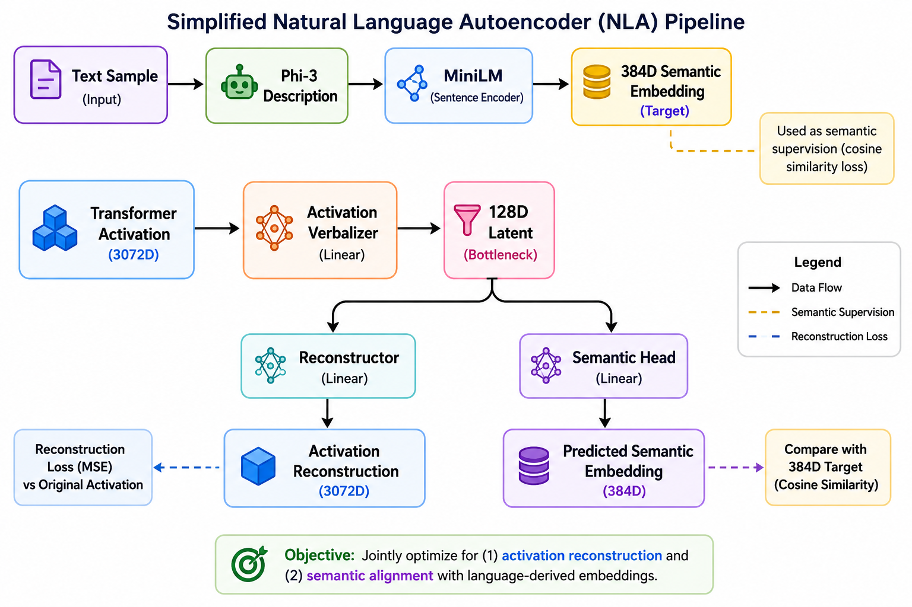
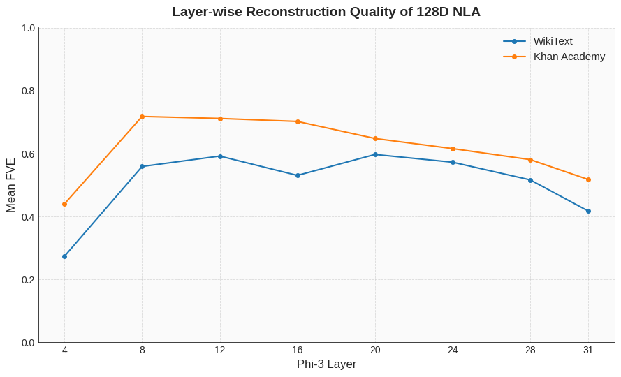

# Simplified Natural Language Autoencoder for Transformer Activations

A simplified reimplementation of Anthropic's Natural Language Autoencoder (NLA) using Phi-3-mini and semantic supervision through MiniLM embeddings.

---

## Project Overview

Large language models process information through high-dimensional internal activations that are difficult for humans to interpret directly. Anthropic's Natural Language Autoencoder (NLA) explores whether these activations can be compressed into a semantic bottleneck and later reconstructed while preserving meaningful information.

Inspired by that work, this project investigates the same question using a smaller open-source model and a computationally practical training setup.

The central question explored is:

> How much information can survive when high-dimensional transformer activations are compressed into a low-dimensional semantically supervised bottleneck?

Rather than attempting an exact reproduction of Anthropic's large-scale system, I focused on building a simplified version that captures the core idea while remaining feasible to train using available computational resources.

### Final Outcome

| Dataset      | Best Layer | Mean FVE |
| ------------ | ---------: | -------: |
| WikiText     |   Layer 20 |    0.597 |
| Khan Academy |    Layer 8 |    0.718 |

The strongest configuration achieved a mean FVE of **0.718**, approaching the range reported in Anthropic's original work despite substantial simplifications.

---

## Approach



**Figure 1.** Simplified Natural Language Autoencoder used in this project. Transformer activations are compressed into a 128-dimensional bottleneck and jointly optimized for activation reconstruction and semantic alignment using MiniLM embeddings derived from Phi-3-generated descriptions.

### Semantic Target Construction

For each text sample:

1. Phi-3 generates a short semantic description.
2. The description is embedded using MiniLM.
3. The resulting 384-dimensional embedding serves as a semantic supervision target.

Importantly, the generated descriptions are not used directly during training. Instead, the model learns to predict the MiniLM embedding derived from those descriptions.

### NLA Architecture

The model consists of three main components:

* **Activation Verbalizer (AV)**: compresses transformer activations into a latent bottleneck.
* **Activation Reconstructor (AR)**: reconstructs the original activation.
* **Semantic Head**: predicts the MiniLM semantic embedding.

The bottleneck is optimized jointly for:

1. Activation reconstruction
2. Semantic alignment

This encourages the latent representation to preserve both activation structure and semantic information.

---

## Experimental Design

### Base Model

I used **Phi-3-mini** because it is:

* Open source
* Relatively recent
* Small enough for repeated experimentation
* Large enough to exhibit meaningful internal representations

### Datasets

Two datasets were used:

* WikiText
* Khan Academy (Cosmopedia)

Each dataset contains approximately 5,000 samples.

### Transformer Layers

The following layers were analyzed:

```text
4, 8, 12, 16, 20, 24, 28, 31
```

### Bottleneck Size

```text
3072D Activation → 128D Latent Bottleneck
```

### Simplifications Relative to Anthropic

| Anthropic NLA                     | This Project            |
| --------------------------------- | ----------------------- |
| Claude Models                     | Phi-3-mini              |
| Sparse Autoencoders               | Dense 128D Bottleneck   |
| Large-Scale Infrastructure        | DGX / Colab             |
| Proprietary Data                  | WikiText + Khan Academy |
| Reinforcement Learning Components | Not Used                |

These simplifications were intentionally chosen to make experimentation feasible while preserving the core idea of semantic bottleneck reconstruction.

---

## Results

### Layer-wise Reconstruction Quality



The figure below compares reconstruction quality across transformer depth for both datasets.

### WikiText Results

| Layer |  Mean FVE |
| ----- | --------: |
| 4     |     0.274 |
| 8     |     0.559 |
| 12    |     0.592 |
| 16    |     0.531 |
| 20    | **0.597** |
| 24    |     0.573 |
| 28    |     0.517 |
| 31    |     0.417 |

### Khan Academy Results

| Layer |  Mean FVE |
| ----- | --------: |
| 4     |     0.440 |
| 8     | **0.718** |
| 12    |     0.712 |
| 16    |     0.702 |
| 20    |     0.648 |
| 24    |     0.616 |
| 28    |     0.581 |
| 31    |     0.518 |

---

## Key Findings

### 1. Semantic Recoverability Depends on Transformer Depth

Reconstruction quality is not uniform across the network.

For both datasets, intermediate transformer layers consistently produced the highest FVE values, suggesting that semantic information is most recoverable in the middle of the transformer hierarchy.

### 2. Educational Content Is Easier to Reconstruct

Khan Academy consistently outperformed WikiText across almost all layers.

This suggests that highly structured educational content may be more compatible with semantic compression than general encyclopedic text.

### 3. Single-Concept Content Reconstructs More Reliably

Qualitative analysis revealed that samples organized around a single dominant concept were reconstructed more effectively than content involving multiple interacting concepts or relationships.

Examples of high-performing topics included:

* Inequality Plotting
* Adding Fractions
* Chemical Kinetics
* Linear Equations

Lower-performing examples often involved multiple related concepts or contextual dependencies.

### 4. The Bottleneck Remained Fully Utilized

Most experiments activated nearly all 128 latent dimensions, indicating that the bottleneck did not collapse during training and that the latent space was used effectively.

### 5. A Simplified NLA Can Approach Anthropic-Like Performance

Despite using a smaller model, a dense bottleneck, and substantially less compute, the strongest configuration achieved an FVE of 0.718.

This suggests that meaningful semantic compression and reconstruction can emerge even under relatively modest computational constraints.

---

## Limitations and Future Work

This project intentionally prioritizes simplicity and reproducibility over exact replication.

Current limitations include:

* Dense bottleneck instead of Sparse Autoencoders
* Single-layer activations analyzed independently
* Approximately 5,000 samples per dataset
* No reinforcement-learning-based optimization

Future work could explore:

* Sparse Autoencoders (SAEs)
* Multi-layer activation bottlenecks
* Token-level activation analysis
* Larger datasets and models
* Alternative semantic supervision methods

---

## Repository Structure

```text
notebooks/
├── 01_Phi3_Data_and_Activation_Generation.ipynb
├── 02_Joint_128D_NLA_Training.ipynb
└── 03_NLA_Results_and_Analysis.ipynb

data/
models/
results/
assets/
```

### Notebook Descriptions

* **01_Phi3_Data_and_Activation_Generation.ipynb**
  Generates semantic descriptions and extracts transformer activations.

* **02_Joint_128D_NLA_Training.ipynb**
  Trains the joint semantic bottleneck model.

* **03_NLA_Results_and_Analysis.ipynb**
  Produces quantitative and qualitative analyses.

---

## Reproducing the Experiments

The full pipeline is:

```text
01_Phi3_Data_and_Activation_Generation.ipynb
                ↓
02_Joint_128D_NLA_Training.ipynb
                ↓
03_NLA_Results_and_Analysis.ipynb
```

All code required to reproduce the reported results is included in this repository.

The notebooks are designed to be executed sequentially, starting from data generation and ending with result analysis.

